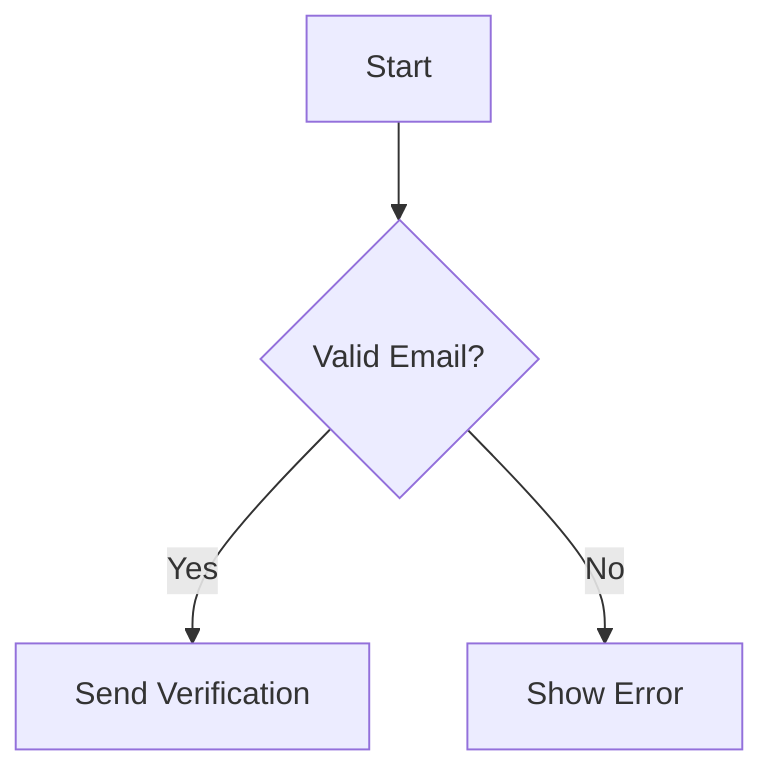
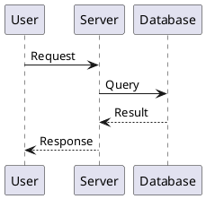

# Miro AI Capabilities

Miro has evolved into an AI Innovation Workspace where teams collaborate with AI on a shared canvas.

## Flows (AI Workflows)

Visual AI workflows that automate multi-step processes by chaining AI instructions and canvas elements.

### How Flows Work
1. Create a Flow on your board
2. Add steps: AI prompts, canvas actions, conditional logic
3. Connect steps to define the process
4. Run the Flow to automate the entire sequence

### Flow Capabilities
- **AI Steps** - Run prompts against LLMs (OpenAI, Anthropic, Gemini)
- **Canvas Steps** - Create stickies, move items, update content
- **Logic Steps** - Conditionals, loops, branching
- **Data Steps** - Read from board, filter, transform

### Flow Use Cases
- Generate meeting notes from sticky note clusters
- Create user stories from requirements documents
- Transform brainstorm output into structured tasks
- Auto-summarize board sections into documents

### Impact
Early adopters report cutting delivery time by 50%+ for routine documentation and analysis tasks.

## Sidekicks (AI Agents)

Conversational AI agents with expertise on specific tasks, available as chat companions on the board.

### Pre-Built Sidekicks
- **Strategy Sidekick** - Business strategy frameworks and analysis
- **Product Sidekick** - User stories, PRDs, roadmaps
- **Design Sidekick** - UX patterns, accessibility, design systems
- **Technical Sidekick** - Architecture diagrams, API design
- **Facilitator Sidekick** - Workshop structures, icebreakers

### Custom Sidekicks
Build your own Sidekick with:
- Custom system prompts
- Access to specific board frames
- Integration with external data sources
- Company-specific knowledge bases

### Sidekick Capabilities
- Read and understand board content
- Generate new content based on context
- Answer questions about board materials
- Suggest improvements and next steps

## AI Diagram Generation

Create diagrams from natural language descriptions or structured notation.

### Supported Diagram Types

| Type | Use Case | Input Format |
|------|----------|--------------|
| **Flowchart** | Processes, workflows, decision trees | Natural language or Mermaid |
| **Mind Map** | Hierarchical ideas, brainstorming | Natural language |
| **UML Class** | Class structures, inheritance | Natural language or PlantUML |
| **UML Sequence** | Component interactions over time | Natural language or PlantUML |
| **Entity Relationship** | Database schemas, data models | Natural language |

### Input Formats

**Natural Language:**
```
User registration flow: start -> enter email -> validate ->
send verification -> confirm -> create account -> end
```

**Mermaid Notation:**


**PlantUML Notation:**


## Model Selection

Enterprise customers can choose their preferred AI provider:

| Provider | Models | Hosting Options |
|----------|--------|-----------------|
| **OpenAI** | GPT-4, GPT-4 Turbo | Azure, OpenAI API |
| **Anthropic** | Claude 3.5, Claude 3 | AWS, Anthropic API |
| **Google** | Gemini Pro, Gemini Ultra | GCP |

### Enterprise Security
- Data residency controls (US, EU, APAC)
- No training on customer data
- SOC 2 Type II compliance
- GDPR compliance with DPA

## Knowledge Integrations

Flows integrate with enterprise AI assistants:

- **Microsoft Copilot** - Access Microsoft 365 context
- **Gemini Enterprise** - Google Workspace integration
- **Glean** - Enterprise search across tools
- **Amazon Q** - AWS and internal knowledge

### Integration Patterns
1. Pull context from enterprise AI into Miro
2. Send Miro content to enterprise AI for analysis
3. Bidirectional sync for living documentation
